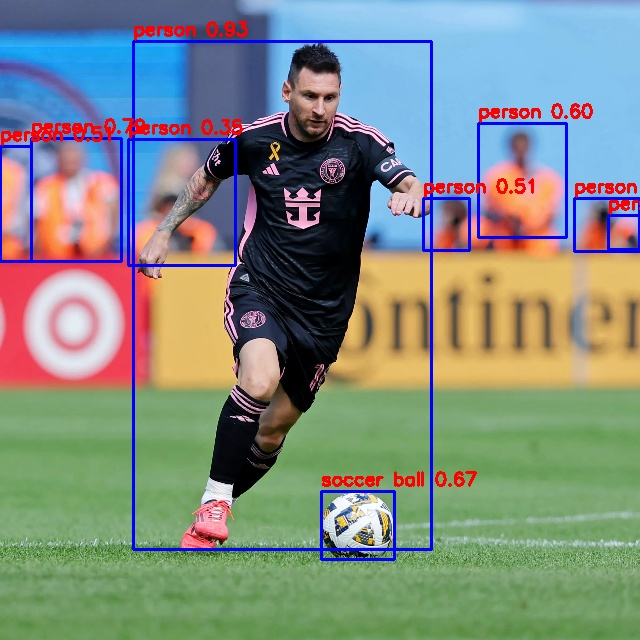

# RKNN(aio3588q board) models

### RKNN System Install
```
- board : aio3588q
- Flash the firmware onto the device first.
```
- in ubuntu (bash)
    ```shell
    sudo apt update && sudo apt upgrade -y
    sudo apt install -y build-essential curl wget git vim nano unzip zip \
    htop net-tools openssh-server software-properties-common

    sudo apt install -y snapd
    sudo apt install chromium-browser

    sudo apt install make
    sudo apt autoremove -y && sudo apt autoclean
    ```

- Install Conda
    ```shell
    bash Anaconda3-2024.10-1-Linux-aarch64.sh 
    ```

- Install VSCode
    ```shell
    sudo dpkg -i code_1.96.2-1734606918_arm64.deb 
    ```

### Set up the RKNN Environment
https://docs.radxa.com/en/rock5/rock5c/app-development/rknn_install

```bash
# Create Projects folder
mkdir Projects
cd Projects

# Download RKNN-Toolkit2 repository
git clone https://github.com/airockchip/rknn-toolkit2.git

# Download RKNN Model Zoo repository
git clone https://github.com/airockchip/rknn_model_zoo.git
```

make env
```shell
conda create -n rknn python=3.8
conda activate rknn
```

install toolkit2
```shell
# Choose the appropriate requirements file according to your python version
pip install -r Projects/rknn-toolkit2/rknn-toolkit2/packages/arm64/arm64_requirements_cp38.txt
pip install Projects/rknn-toolkit2/rknn-toolkit2/packages/arm64/rknn_toolkit2-2.3.0-cp38-cp38-manylinux_2_17_aarch64.manylinux2014_aarch64.whl
```

Install Toolkit2-Lite
```shell
pip install Projects/rknn-toolkit2/rknn-toolkit-lite2/packages/rknn_tool
kit_lite2-2.3.0-cp38-cp38-manylinux_2_17_aarch64.manylinux2014_aarch64.whl
```

Install ETC
https://github.com/radxa-pkg/rknn2/releases
```

sudo apt-get update
sudo apt-get install -y python3-ruamel.yaml python3-psutil python3-numpy

sudo dpkg -i --force-overwrite python3-rknnlite2_2.3.0-1_arm64.deb
sudo dpkg --install --force-overwrite rknpu2-rk3588_2.3.0-1_arm64.deb
```


- [YOLO WORLD](https://github.com/tommyjin2894/rknn_yolo_world)<br>
    
    ```text
        done!
       class        score      xmin, ymin, xmax, ymax
    --------------------------------------------------
       person       0.932     [ 133,   41,  431,  549]
       person       0.795     [  31,  138,  121,  261]
       person       0.595     [ 478,  123,  566,  237]
       person       0.510     [   0,  146,   31,  261]
       person       0.510     [ 423,  198,  469,  250]
       person       0.425     [ 574,  198,  639,  251]
       person       0.351     [ 128,  139,  235,  265]
       person       0.270     [ 608,  215,  639,  249]
    soccer ball     0.665     [ 321,  491,  394,  559]
    Save results to result.jpg!
    ```
